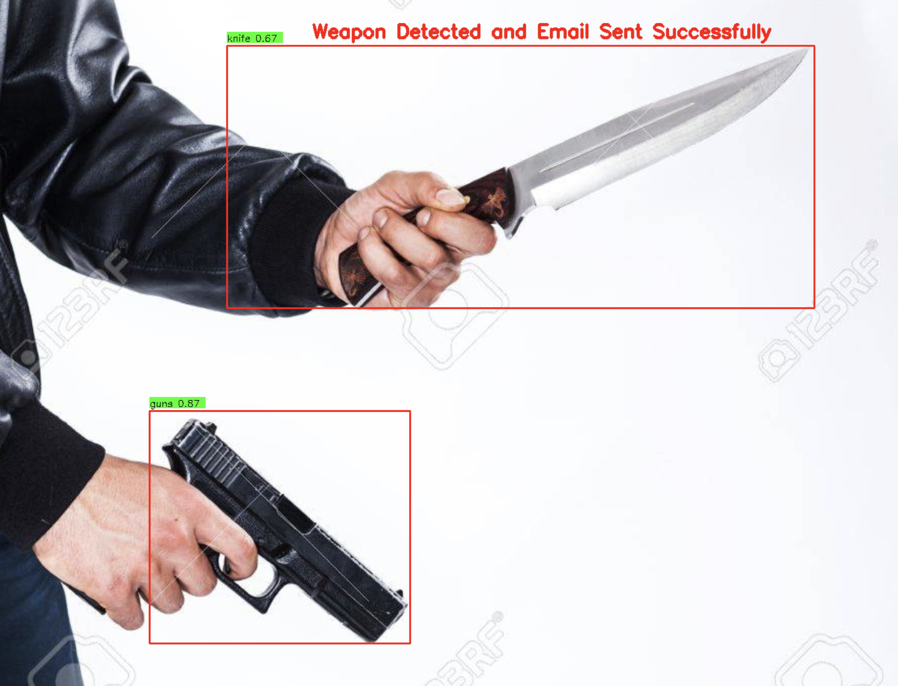

# Weapon Detection Using YOLOv8

This repository contains two weapon detection projects powered by YOLOv8, designed for security and surveillance applications.

The projects focus on:

Video Weapon Detection: This script processes video streams (such as CCTV footage or live webcam feeds) to detect weapons in real-time. When a weapon is detected, it draws bounding boxes around the detected object and sends an immediate email alert to notify security personnel.
Image Weapon Detection: This script processes individual images, detecting and blurring any identified weapons. The system also sends email alerts when a weapon is detected in an image, making it useful for analyzing still photos or frames from recorded footage.




## Features

- Weapon detection using YOLOv8 models.
- Sends email alerts when a weapon is detected.
- For video processing, the detection results are displayed in real-time.
- For image processing, detected regions are blurred and displayed.

## Requirements

- Python 3.7+
- The following Python packages:
  - `ultralytics` (for YOLOv8)
  - `opencv-python`
  - `yagmail`
  - `numpy`

You can install the required packages using the following command:

```bash
pip install ultralytics opencv-python yagmail numpy
```

## Usage

### 1. Video Weapon Detection

The `video_weapon_detection.py` script processes a video source, detects weapons, and sends an email alert when a weapon is detected.

#### Running the Video Detection Script

1. Update the `model_path` variable in the script to point to your YOLOv8 weights file (e.g., `best.pt`).
2. Update the `email` and `email_password` variables with your email and app password (for example, use Gmail with an app password).
3. Run the script:

```bash
python video_weapon_detection.py
```

#### Example Code: Video Weapon Detection

```python
from typing import List
import cv2
from ultralytics import YOLO
import yagmail

class WeaponVideoProcessor:
    # Code for processing video streams and detecting weapons
```

### 2. Image Weapon Detection

The `image_weapon_detection.py` script processes a single image, detects weapons, and sends an email alert when a weapon is detected. The detected regions are blurred, and the result is displayed.

#### Running the Image Detection Script

1. Update the `model_path` in the `load_yolo_model` function to point to your YOLOv8 weights file.
2. Set the `image_file` variable to the path of the image you want to process.
3. Update the `email` and `email_password` variables with your email and app password.
4. Run the script:

```bash
python image_weapon_detection.py
```

#### Example Code: Image Weapon Detection

```python
from typing import List, Tuple
import cv2
from ultralytics import YOLO
import yagmail

class WeaponImageProcessor:
    # Code for processing images and detecting weapons
```

## Email Notification Setup

Both scripts use the `yagmail` library to send email alerts when a weapon is detected. To use this feature, you will need to:

1. Set up a Gmail account with an app-specific password (if using Gmail). [Learn how to create an app password](https://support.google.com/accounts/answer/185833).
2. Replace the `email` and `email_password` fields with your email and app password.
3. Update the `to_email` variable in the scripts with the recipient email address.

## Model

You will need to provide your own YOLOv8 model trained on weapon detection. If you haven't trained a YOLOv8 model, you can follow the instructions on the [Ultralytics YOLOv8 documentation](https://docs.ultralytics.com/).

## How It Works

- The scripts load a pre-trained YOLOv8 model for detecting weapons.
- For video processing, each frame is passed through the model, and detected objects are highlighted with bounding boxes. An email is sent if a weapon is detected.
- For image processing, the image is loaded, processed through the YOLOv8 model, and blurred in regions where weapons are detected. The image is then displayed, and an email alert is sent.

## License

This project is licensed under the MIT License. See the [LICENSE](LICENSE) file for details.

## Acknowledgments

- [Ultralytics YOLOv8](https://github.com/ultralytics/ultralytics) for the YOLOv8 model.
- [Yagmail](https://github.com/kootenpv/yagmail) for handling email notifications.
